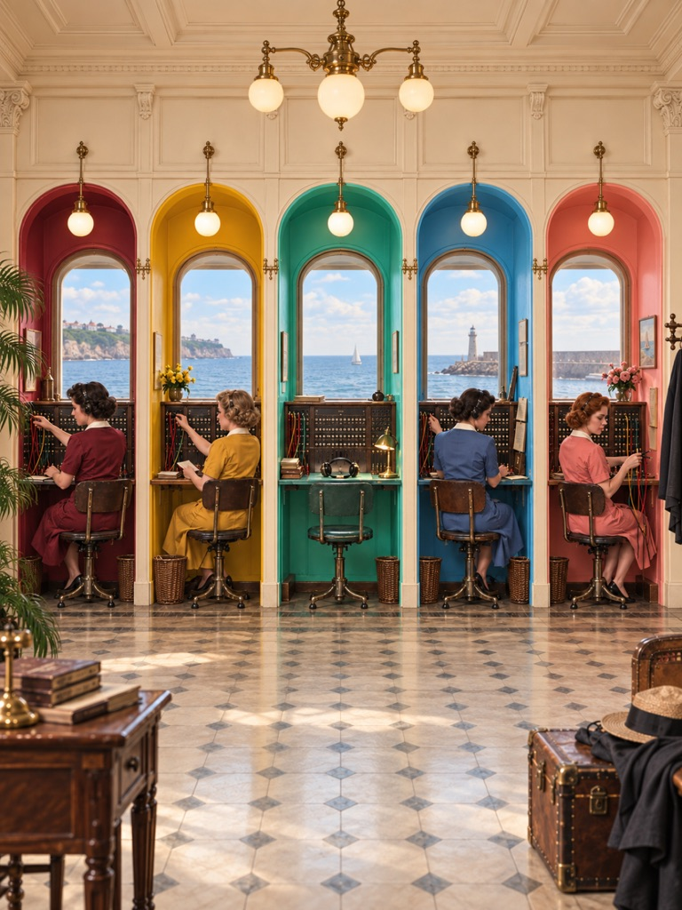
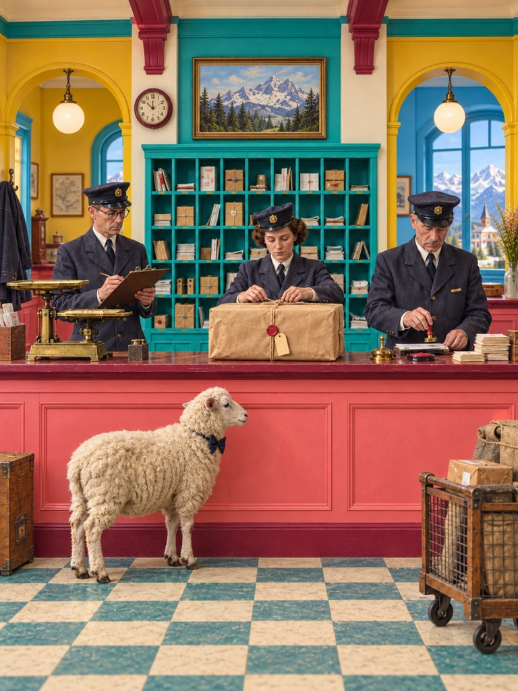
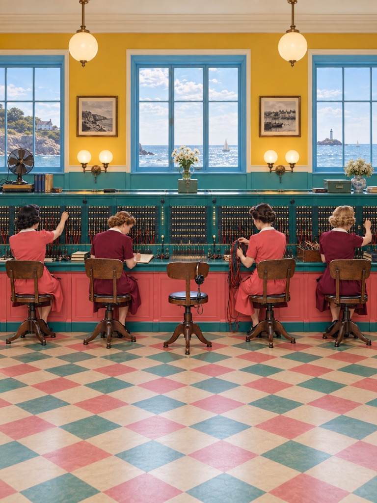
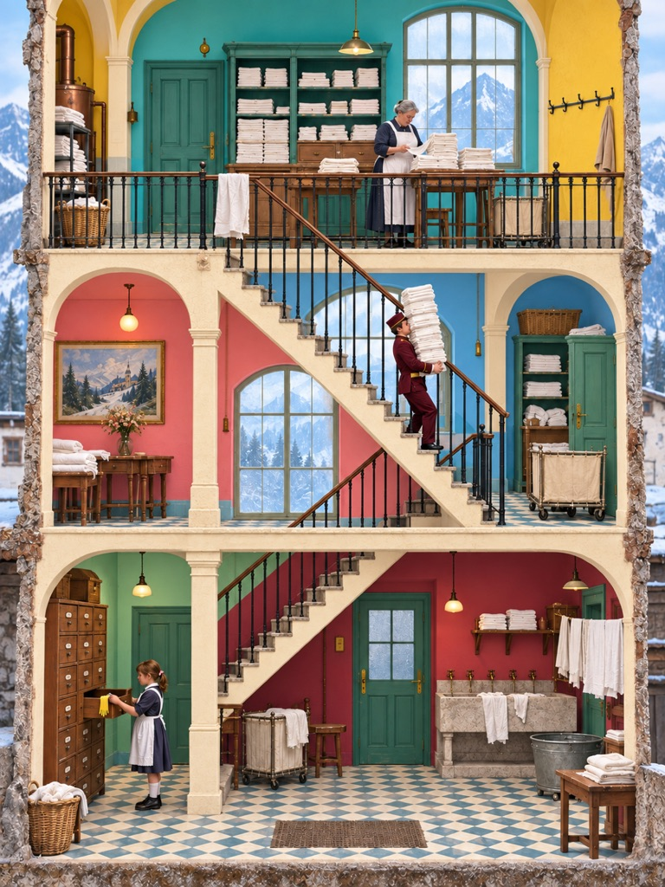
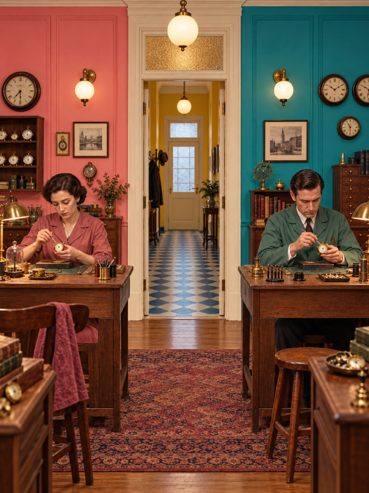
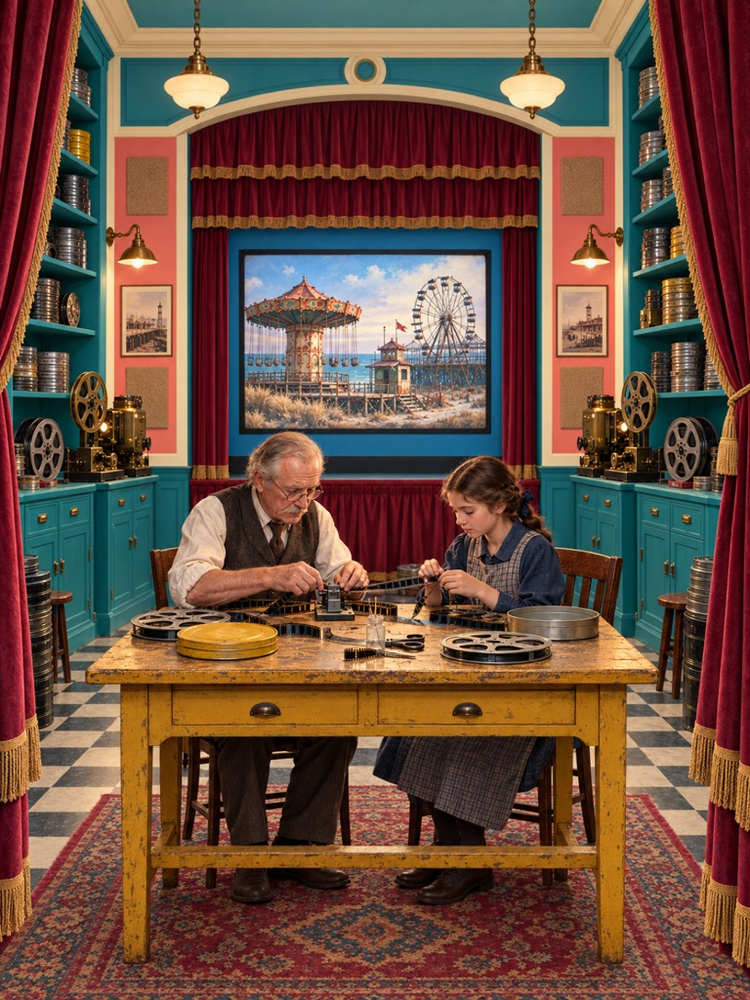

# SanJin-维斯·安德森美学

[简体中文](#简体中文) · [English](#english)

<a id="简体中文"></a>

将文字主题、照片或产品素材转译为原创的复古电影感静态画面：用精确构图、高饱和马卡龙撞色、制服、档案道具与克制表演，包裹失去、记忆、家庭、归属或秩序崩塌。它不是给画面覆盖灰褐复古滤镜，而是一套高色彩冲击与含蓄叙事互相解释的视觉系统。

本技能不会复刻任何具体电影镜头，也不会复制参考图中的人物、道具组合、文字、房间布局或标志性元素。它使用可复用的视觉语法完成新的故事和场景。

## 能做什么

- 根据主题生成原创电影感静态场景。
- 将照片、人物、产品或建筑转译到该视觉系统，同时保留约定特征。
- 分析参考图，输出固定规则、可变量与来源残留禁区。
- 只编写可复用提示词、负面约束和输出规格。
- 用章节页、档案条目、回忆转述、舞台中的舞台或并行小传组织复杂叙事。
- 通过质量门禁检查形式—情感关系、画幅理由、人物身份、档案道具、年代感与文字污染。

## 核心视觉原则

- 固定正面、平视镜头；中心轴、二分或模块网格清晰可读，并允许一个有意义的秩序破口。
- 画幅参与叙事：近方形、常规宽屏、宽银幕、4:3 或竖幅需服务年代与空间关系。
- 粉红、青绿、芥末黄、天蓝、酒红、薄荷绿等形成 3–6 个高明度、高饱和马卡龙大色区。
- 彩色色块覆盖约 60–85% 画面，至少两种主色大面积相撞；奶油白负责分隔和留出呼吸。
- “Muted”不等于灰暗或浑浊：禁止全局降饱和、灰褐罩染、脏灰肤色和颜色糊成一片。
- 灯、门、窗、台阶、隔间、柜台和家具形成重复节拍，并保留一处小偏差。
- 人物表情克制；固定服装、头衔、团队任务与随身物件构成人物档案。
- 通过视线、停顿、距离、物件缺口与过时仪式表达情绪，避免直白煽情。
- 零到一个轻微荒诞锚点；它被人物当作日常事务处理。
- 柔和均匀光、中等明暗反差、高色相反差、暖净肤色、微缩/舞台/手工质感、哑光年代材质和不降低饱和度的细腻胶片颗粒。

## 示例图

以下案例均由本技能生成或转译，统一采用 3:4 竖幅、高饱和马卡龙大色区与克制的年代叙事。

<table>
  <tr>
    <td align="center"><br><sub>海滨电话交换所</sub></td>
    <td align="center"><br><sub>山地邮局</sub></td>
    <td align="center"><br><sub>长台接线室</sub></td>
  </tr>
  <tr>
    <td align="center"><br><sub>高山洗衣房剖面</sub></td>
    <td align="center"><br><sub>钟表修理室</sub></td>
    <td align="center"><br><sub>电影档案室</sub></td>
  </tr>
</table>

## 安装

将整个文件夹复制到 Codex skills 目录，保持技术目录名不变：

```text
<CODEX_HOME>/skills/sanjin-wes-anderson-aesthetic/
```

重启或刷新 Codex 后即可发现该技能。界面名称显示为“SanJin-维斯.安德森美学”。

## 使用示例

```text
使用 $sanjin-wes-anderson-aesthetic 生成一张 4:3 原创画面：一座山间邮局，三位职员正在给一只戴领结的羊办理包裹寄送。
```

```text
使用 $sanjin-wes-anderson-aesthetic 将这张咖啡店照片改造成对称的 1960 年代酒店餐厅，保留店主和吧台，使用亮玫瑰粉、饱和青绿、芥末黄和奶油白形成大面积撞色。
```

```text
使用 $sanjin-wes-anderson-aesthetic 分析这组参考图，只输出视觉规则、可变量、来源残留禁区和一份结构化生成提示词。
```

## 文件结构

```text
SKILL.md                              # 主流程、路由、默认规格与关键禁区
agents/openai.yaml                    # Codex 界面元数据
references/
├── visual-system.md                  # 固定视觉规则、色板、构图与人物调度
├── narrative-system.md               # 情感发动机、叙事框架、人物与幽默机制
├── scene-recipes.md                  # 七种空间/叙事配方
├── prompt-compiler.md                # 生成、转译与文字请求的提示词结构
├── quality-gate.md                   # 交付验收和常见失败修订
└── reference-index.md                # 九张用户参考图的证据索引
assets/style-references/              # 用户提供的九张视觉参考
assets/examples/                      # 六张 3:4 高饱和马卡龙示例图
scripts/export_still.py               # RGB JPG/PNG 导出与比例、尺寸检查
```

## 结构来源

目录与渐进式信息披露方式参考了 [restrained-hand-drawn-illustration](https://github.com/YuuZhen/restrained-hand-drawn-illustration) 的公开组织方式；本技能的视觉系统、流程、提示词、质量标准和脚本均针对当前需求重新编写。

---

<a id="english"></a>

## English

Create original, meticulously art-directed mid-century cinematic stills from a brief, photo, product, or building. The system combines frontal geometry, high-saturation macaron color fields, large-area color clashes, uniforms, archival props, handcrafted sets, and deadpan blocking. Muted does not mean gray or muddy: preserve clear pink, teal, mustard, blue and burgundy blocks, warm clean skin tones, and strong chromatic impact.

It does not recreate specific film frames or copy people, props, text, layouts, or signature motifs from the supplied references.

### Installation

Copy the complete folder to:

```text
<CODEX_HOME>/skills/sanjin-wes-anderson-aesthetic/
```

Restart or refresh Codex, then invoke it with `$sanjin-wes-anderson-aesthetic`.

### Example

```text
Use $sanjin-wes-anderson-aesthetic to create an original 4:3 mountain post office where three clerks formally process a parcel for a sheep wearing a bow tie.
```
