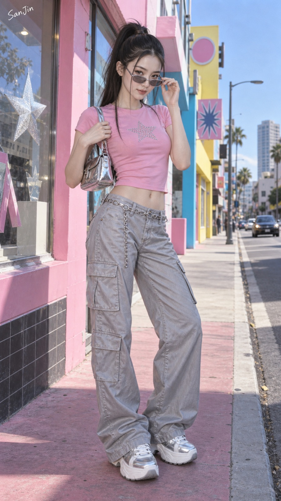
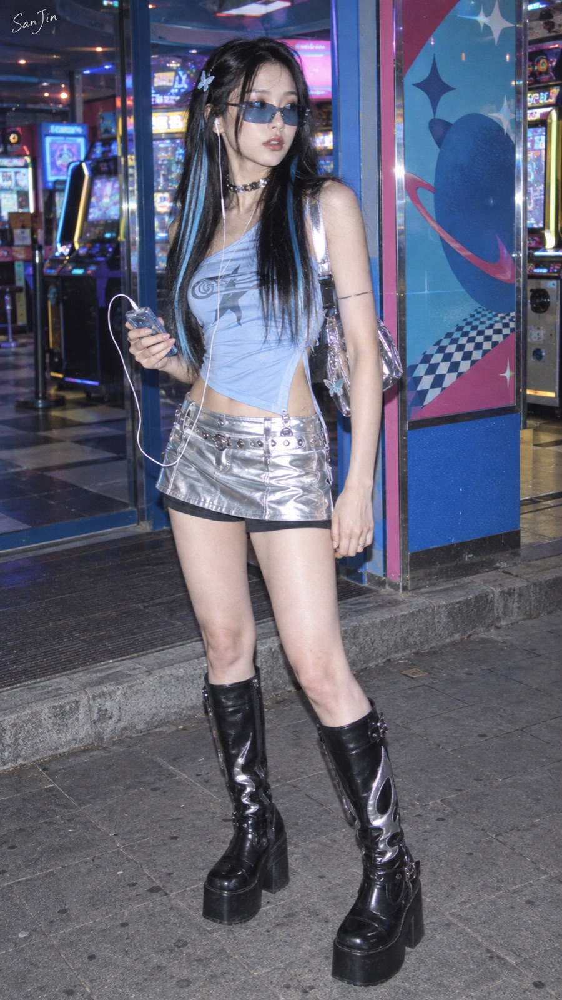
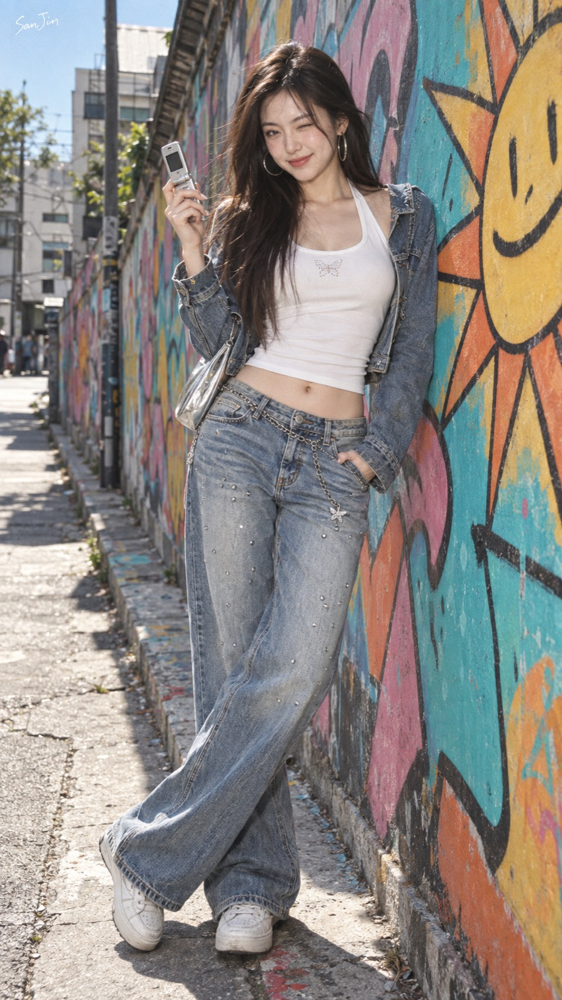
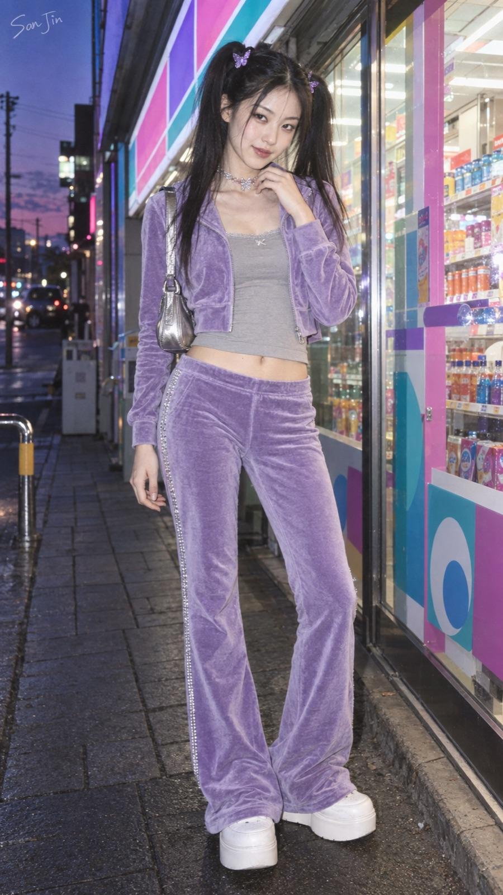
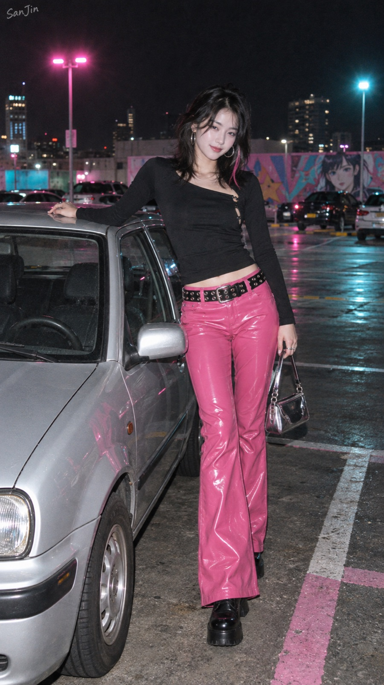
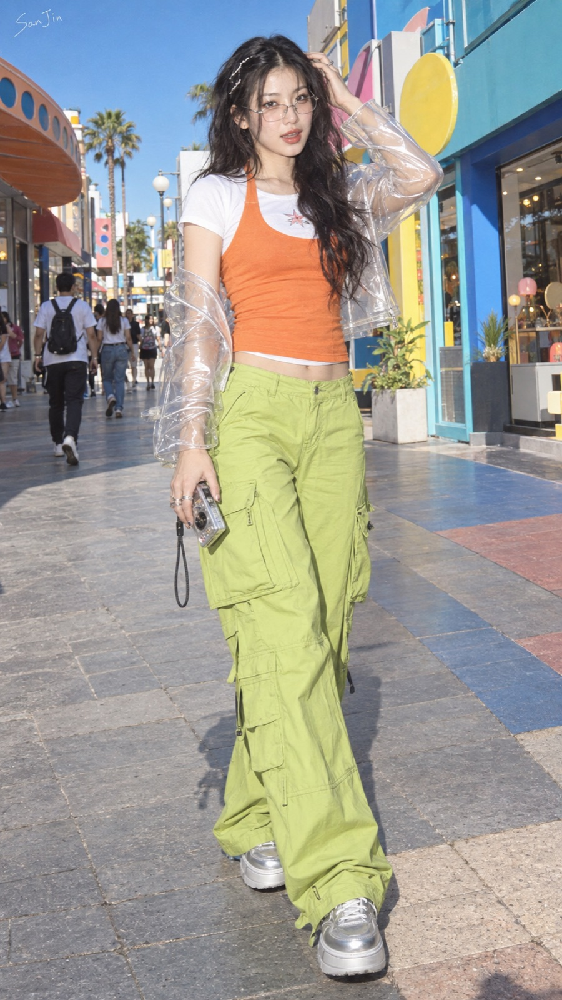

# SanJin-Y2K千禧辣妹

[简体中文](#简体中文) · [English](#english)

<a id="简体中文"></a>

将成年女性角色、服装需求或照片转译为 1998–2005 年流行文化想象中的“千禧辣妹派”视觉：以低腰与短款廓形、高饱和甜酷配色、牛仔与金属材质冲突、时代配饰、彩色街区和早期 CCD 快照质感，形成 **甜美 × 性感 × 自信 × 反叛 × 复古未来** 的时尚画报。

本技能默认使用原创的冷艳灵动东方爱豆脸，不模仿真实艺人；性感来自成年女性的身体自主与造型表达，保持完整时尚穿着和非挑逗画报尺度。它不会把 Y2K 简化成“粉色 + 霓虹灯 + 未来科技”，也不会滑向现代赛博朋克、Clean Girl 或普通网红摄影。

## 能做什么

- 根据文字需求生成完整的 Y2K 千禧辣妹造型与成图。
- 将用户指定的服装、人物或场景改写为可直接用于生图的提示词。
- 编辑用户提供的图片，同时锁定人物身份、脸部、姿态、构图或指定服装。
- 在用户没有参考图时，自动补全人物、穿搭、妆发、配饰、街区背景与摄影语言。
- 提供粉色流行公主、冰蓝金属辣妹、水洗牛仔街头、黑粉夜间闪光等差异化方向。
- 通过终检规则排除假人脸、夸张动作、时代错位、风格污染、错误文字和多余水印。

## 核心视觉原则

- 时间锚点为 1998–2005 年，强调 Teen Pop、MTV、青少年时尚杂志、明星街拍、早期互联网与消费电子审美。
- 默认人物为 20–28 岁成年女性，使用不对应任何真实艺人的原创东方爱豆脸。
- 保留毛孔、细小绒毛、浅淡眼下纹理、轻微肤色起伏与自然左右不对称，避免塑料蜡像皮肤和空洞假人表情。
- 表情采用“冷感底色 + 古灵精怪微表情”，例如轻微挑眉、侧视回看、单侧嘴角微扬或克制眨眼。
- 优先使用短上衣与低腰下装、紧身上装与迷你裙/长靴、修身短夹克与低腰微喇裤等千禧比例。
- 用牛仔、水钻、亮片、天鹅绒、丝绸、金属、漆皮、PVC 或透明塑料形成“复古 × 未来”的可见材质冲突。
- 采用泡泡糖粉、冰蓝、薰衣草紫、金属银、亮橙、酸性绿、牛仔蓝、白与黑构建高识别度配色。
- 场景优先选用涂鸦巷、彩色商业街、便利店、街机店、停车场等具有空间纵深的千禧街头。
- 姿势保持专业画报尺度：舒展、克制、重心稳定，避免深蹲贴镜头、四肢冲向镜头、极端扭转与鱼眼畸变。
- 默认采用早期便携数码相机/CCD 摄影质感：直闪、轻微过曝、细微噪点、克制色差与不完美抓拍感。
- 默认仅在左上角添加一个拼写准确、尺寸克制的 `SanJin` 手写签名，不生成其他可读文字、Logo 或水印。

## 安装

将整个文件夹复制到 Codex skills 目录，保持技术目录名不变：

```text
<CODEX_HOME>/skills/sanjin-y2k-millennium-babe/
```

重启或刷新 Codex 后即可发现该技能。界面名称显示为“SanJin-Y2K千禧辣妹”。

## 使用示例

```text
使用 $sanjin-y2k-millennium-babe 生成一张 9:16 Y2K 千禧辣妹街拍：粉色 Baby Tee、银灰低腰工装裤、金属腋下包，站在彩色商业街，日间填充闪光。
```

```text
使用 $sanjin-y2k-millennium-babe 把这张人物照片改造成冰蓝与金属银配色的千禧时尚画报，保留人物身份、脸部和姿势，将背景改为街机店门口。
```

```text
使用 $sanjin-y2k-millennium-babe 给我 4 套不重复的 Y2K 造型提示词，轮换发型、微表情、配色、服装、姿势和街区结构。
```

## 示例图

| Pink Y2K 商业街 | Ice Blue 街机店 |
| --- | --- |
|  |  |

| 水洗牛仔涂鸦巷 | 紫粉天鹅绒便利店 |
| --- | --- |
|  |  |

| 黑粉夜间停车场 | 亮橙酸绿商业街 |
| --- | --- |
|  |  |

## 文件结构

```text
SKILL.md                              # 主流程、任务路由、提示词组装与终检
README.md                             # 中英文说明、安装方式、使用示例与示例图
agents/openai.yaml                    # Codex 界面元数据与调用策略
references/style-bible.md             # 人脸、服装、材质、配色、妆发、场景和摄影规则
assets/examples/                      # 六张压缩后的 9:16 示例图
```

## 设计依据

- 黄菲、林逸、陈嘉宝：《[基于亚文化理论的Y2K美学风格谱系](https://www.fcipub.org/articleDetail/4814?periodicalId=7)》，重点采用色彩、图案、廓形与材质的四维分析，以及“千禧辣妹派”的文化与视觉定义。
- 用户提供的实际生图反馈，用于调整东方爱豆脸的真实感、古灵精怪微表情、时尚画报姿势、街头背景、CCD 摄影和批量差异化策略。

---

<a id="english"></a>

## English

Create or transform adult-women fashion imagery into an original 1998–2005 Y2K millennium-babe editorial system. It combines low-rise and fitted silhouettes, saturated candy colors, denim-and-chrome material contrasts, period accessories, colorful streets, restrained model poses, and early compact-digital/CCD flash photography.

The default subject is an original adult East Asian woman who does not resemble a real celebrity. Natural pores, subtle asymmetry, flyaway hairs, expression texture, and believable garment folds keep the face and styling from feeling artificial. The intended tone is sweet, confident, rebellious, playful, and retro-futuristic—not modern cyberpunk, Clean Girl, Old Money, or generic influencer photography.

### Installation

Copy the complete folder to:

```text
<CODEX_HOME>/skills/sanjin-y2k-millennium-babe/
```

Restart or refresh Codex, then invoke it with `$sanjin-y2k-millennium-babe`.

### Example

```text
Use $sanjin-y2k-millennium-babe to create a 9:16 Y2K street-fashion editorial with a pink baby tee, silver-gray low-rise cargo trousers, a metallic shoulder bag, a colorful commercial street, and subtle daylight fill flash.
```
